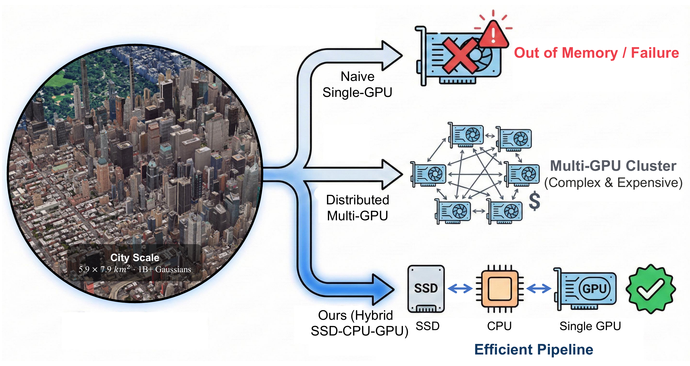
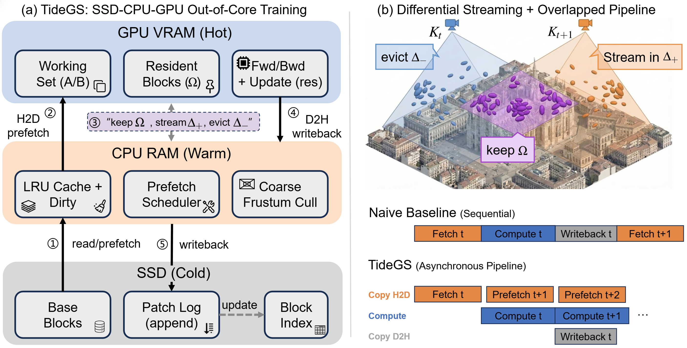
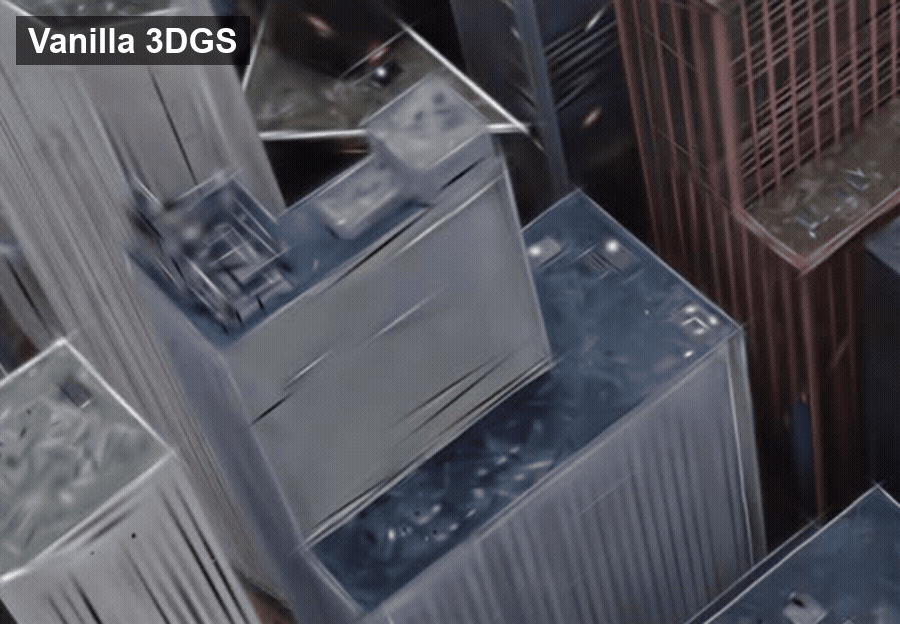

# TideGS

[](https://arxiv.org/abs/2605.20150)
[](https://huggingface.co/papers/2605.20150)
[](https://sponge-lab.github.io/TideGS)
[](LICENSE)

TideGS is a system for training large-scale 3D Gaussian Splatting scenes with
SSD-based out-of-core optimization. It keeps the full Gaussian parameter array
on SSD, uses CPU DRAM as a tiered cache, and materializes only the active
resident blocks in GPU memory.

<p align="center">
  
</p>

## Features

- Train city-scale 3DGS scenes without keeping the full Gaussian set in GPU memory.
- Stream Gaussian blocks between SSD, CPU memory, and GPU resident buffers.
- Reuse prebuilt SSD bases for repeated experiments without reprocessing the PLY.
- Resume training from incremental checkpoints without copying the full base file.

## Method Overview

<p align="center">
  
</p>

## Visual Comparison

<p align="center">
  
</p>

## Installation

The release experiments used Python 3.10 with `torch==2.4.0+cu124`,
`torchvision==0.19.0+cu124`, and `torchaudio==2.4.0+cu124`. Install a matching
PyTorch stack for your CUDA/platform first, then install the remaining Python
dependencies and project extensions:

```bash
pip install -r requirements.txt
pip install --no-build-isolation submodules/clm_kernels
pip install submodules/fast-tsp
pip install --no-build-isolation submodules/gsplat
pip install --no-build-isolation submodules/simple-knn
```

Set PyTorch allocation behavior before training:

```bash
export PYTORCH_CUDA_ALLOC_CONF=expandable_segments:True
```

## Data Preparation

TideGS experiments use MatrixCity-style aerial/street scenes. Download the RGB,
camera-pose, and depth resources from the official
[MatrixCity repository](https://github.com/city-super/MatrixCity), then follow
its data-generation instructions to produce the initial dense point cloud.

The camera directory passed to `-s` / `--src` must contain MatrixCity transform
files:

```text
<scene_dir>/
  transforms_train.json
  transforms_test.json
```

Each frame in the transform files should reference an image through
`file_name` or `file_path`. The loader resolves MatrixCity paths relative to the
transform directory and the split folder, so a typical layout is:

```text
<dataset_root>/
  pose/all_blocks/
    transforms_train.json
    transforms_test.json
  train/
    0000.png
    0001.png
    ...
  test/
    ...
  point_cloud/
    matrixcity_1b.ply
```

The exact folder names can differ as long as `transforms_train.json` and
`transforms_test.json` point to valid image files. During the first run, images
are decoded into raw files under `--decode-dataset-path`; put this cache on a
large local or shared SSD.

## Recommended Paths

The release scripts do not hard-code local dataset paths. Set these variables
for your machine:

```bash
export TIDEGS_ROOT=/path/to/tidegs_outputs
export MATRIXCITY_SCENE_DIR=/path/to/MatrixCity/pose/all_blocks
export TIDEGS_DENSE_PLY=/path/to/matrixcity_1b.ply
export TIDEGS_DECODE_CACHE=$TIDEGS_ROOT/decoded_cache/matrixcity
```

If you already built an SSD base, also set:

```bash
export TIDEGS_PREBUILT_MANIFEST=/path/to/streaming_init_manifest.json
```

## Build Or Reuse An SSD Base

For a fresh run without `TIDEGS_PREBUILT_MANIFEST`, the training command streams
`$TIDEGS_DENSE_PLY` into an SSD base before training. This is correct but can be
slow for billion-point scenes.

For repeated experiments, reuse a prebuilt SSD base by passing the generated
`streaming_init_manifest.json`:

```bash
--manifest $TIDEGS_PREBUILT_MANIFEST
```

A prebuilt manifest points to:

```text
base_file.bin
block_bounds.npy
streaming_init_manifest.json
```

`base_file.bin` stores the immutable initial `[N, 59]` float32 block array.
Patch logs and checkpoints are written to the current run's SSD cache directory.

## Training

Run the accepted full-camera MatrixCity 1B configuration:

```bash
GPU=0 \
RUN_TAG=$(date +"%Y%m%d_%H%M%S")_tidegs_1b_train \
bash scripts/train_matrixcity_1b.sh \
  --mode train \
  --iterations 240 \
  --bsz 16 \
  --capacity 2048 \
  --resident-policy topc_balanced \
  --resident-lambda 0.3 \
  --resident-decay 0.95 \
  --balanced-seed-fraction 0.25 \
  --debug-max-train-cameras -1 \
  --debug-camera-sample-mode contiguous \
  --src "$MATRIXCITY_SCENE_DIR" \
  --ply "$TIDEGS_DENSE_PLY" \
  --manifest "$TIDEGS_PREBUILT_MANIFEST" \
  --decode-dataset-path "$TIDEGS_DECODE_CACHE" \
  --root "$TIDEGS_ROOT"
```

The `debug-max-train-cameras` option controls the camera cap. In release commands,
`--debug-max-train-cameras -1` disables the camera cap and uses all training
cameras. Positive values are only for quick smoke or locality diagnostic runs.

The runner is quiet by default: the terminal shows progress bars, while detailed
training stdout is written to `python.log`. Use `--debug-logging` to add detailed
runtime markers to `python.log`. Use `--verbose-terminal` only when actively
debugging and you want the training subprocess to stream to the terminal.

The accepted 1B configuration is:

```text
batch size: 16
resident block capacity: 2048
resident policy: balanced TopC
resident lambda: 0.3
recency decay: 0.95
balanced seed fraction: 0.25
projection camera chunk: 2
RAM cache budget: 32 GB
checkpoint mode: incremental
```

## Checkpoint And Resume

Run 1000 iterations with an incremental checkpoint at 500:

```bash
GPU=0 \
RUN_TAG=$(date +"%Y%m%d_%H%M%S")_tidegs_ckpt1000 \
bash scripts/train_matrixcity_1b.sh \
  --mode checkpoint \
  --bsz 16 \
  --capacity 2048 \
  --checkpoint-iter 500 \
  --debug-max-train-cameras -1 \
  --debug-camera-sample-mode contiguous \
  --src "$MATRIXCITY_SCENE_DIR" \
  --ply "$TIDEGS_DENSE_PLY" \
  --manifest "$TIDEGS_PREBUILT_MANIFEST" \
  --decode-dataset-path "$TIDEGS_DECODE_CACHE" \
  --root "$TIDEGS_ROOT"
```

Resume from the checkpoint:

```bash
CKPT=/path/to/run/checkpoints/500

GPU=0 \
RUN_TAG=$(date +"%Y%m%d_%H%M%S")_tidegs_resume500_to1500 \
bash scripts/train_matrixcity_1b.sh \
  --mode resume \
  --start-checkpoint "$CKPT" \
  --resume-to-iter 1500 \
  --bsz 16 \
  --capacity 2048 \
  --debug-max-train-cameras -1 \
  --debug-camera-sample-mode contiguous \
  --src "$MATRIXCITY_SCENE_DIR" \
  --ply "$TIDEGS_DENSE_PLY" \
  --decode-dataset-path "$TIDEGS_DECODE_CACHE" \
  --root "$TIDEGS_ROOT"
```

Incremental checkpoints save the training state, the log-structured storage
index, and the patch files needed by the latest block versions. They do not copy
the immutable 1B `base_file.bin`.

## Outputs

Training logs, configurations, checkpoints, and SSD cache files are written under
`$TIDEGS_ROOT/output` and `$TIDEGS_ROOT/ssd_cache`.

## Acknowledgements

This repository builds on and takes important reference from
[CLM-GS](https://github.com/nyu-systems/CLM-GS) and
[gsplat](https://github.com/nerfstudio-project/gsplat). We thank the authors
for releasing their code.

## License

TideGS is released under the Apache License 2.0. Third-party submodules and
dependencies are governed by their own licenses.

## Citation

```bibtex
@inproceedings{zhong2026tidegs,
  title={{TideGS}: Scalable Training of Over One Billion 3D Gaussian Splatting Primitives via Out-of-Core Optimization},
  author={Zhong, Chonghao and Shi, Linfeng and Chen, Hua and Sun, Tiecheng and Zhao, Hao and Yuan, Binhang and Li, Chaojian},
  booktitle={International Conference on Machine Learning},
  year={2026},
  organization={PMLR}
}
```
